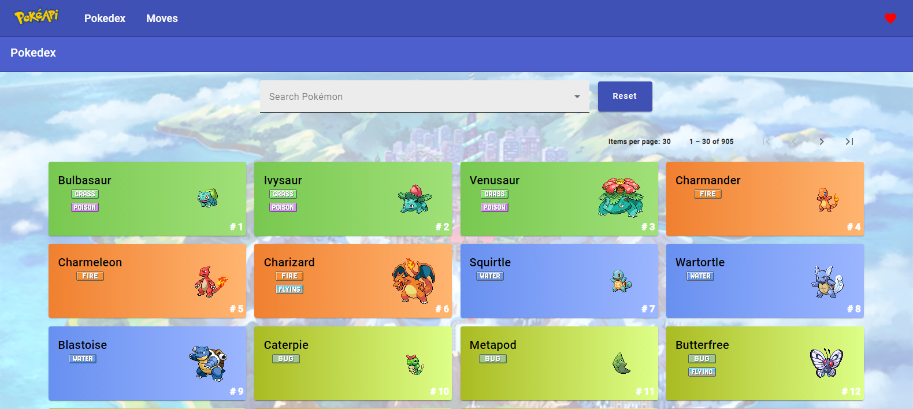
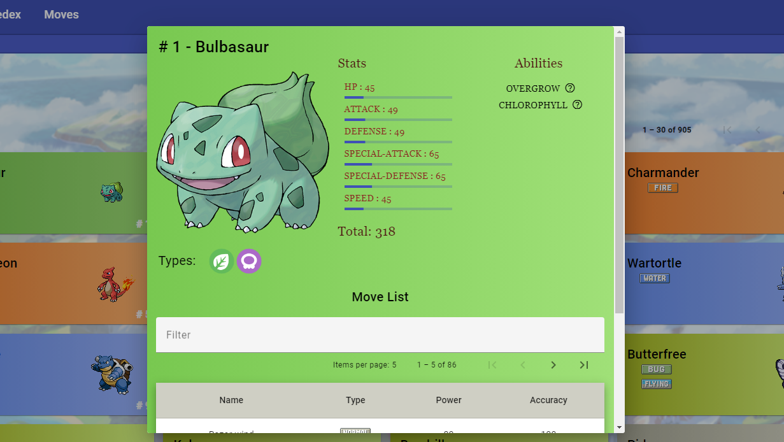
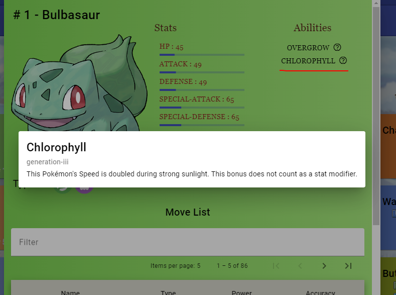
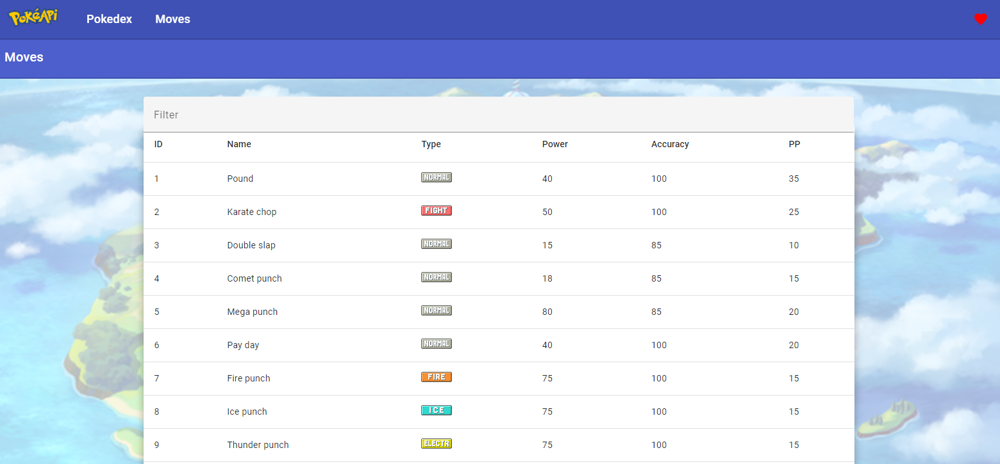

# PokeAPI with Angular 17 and Angular Material
This project is an Angular 17 application that utilizes the PokeAPI to display information about Pokémon. It is developed using Angular Material to ensure a beautiful and responsive user interface.

## Screenshots

   
   
   
   

## Technologies Used
-  Angular
-  Angular Material
-  HTML
-  CSS 
-  TypeScript

## How to Use
### Installation: 
Make sure you have Node.js and Angular CLI installed on your machine. Clone this repository and run npm install to install the dependencies.

### Development server: 
Run ng serve to start a development server. Navigate to http://localhost:4200/ to view the application in your browser.

### Build: 
To compile the application for production, use the command ng build. The build artifacts will be stored in the dist/ directory.

## Features
- Pokémon Listing: View a list of Pokémon with their names, images, and types.
- Pokémon Details: Click on a Pokémon to get detailed information about it, such as statistics, abilities, and moves.
- Pokémon Search: Use the search bar to find specific Pokémon by name.
- Move List: See a list of all moves.
- Ability details: Modal with the details of each ability that the Pokémon can have.

## Credits
#### PokeAPI: Credits to PokeAPI for providing the API for data retrieval.
#### Bulbapedia: Credits to Bulbapedia for providing information, icons, and layout ideas.
#### Pokémon Company: Credits to the Pokémon Company for being the owner of the Pokémon brand.

## About
This software is 100% free, open-source and unlicensed.
