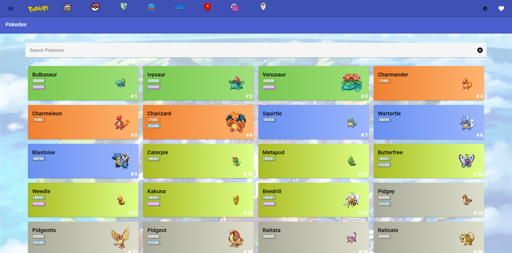
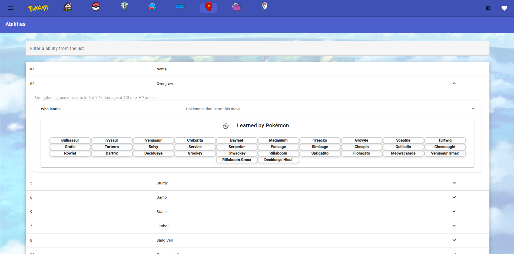
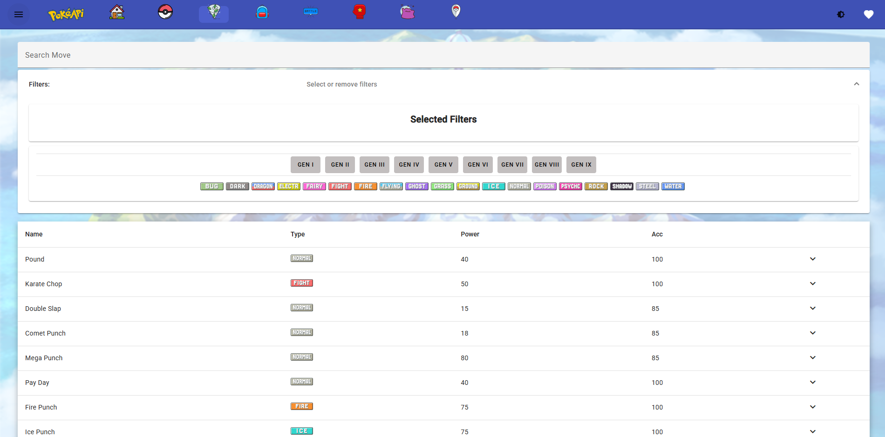

#   PokeAPI with Angular 17 and Angular Material 
This project is an Angular 17 application that utilizes the PokeAPI to display information about Pokémon. It is developed using Angular Material to ensure a beautiful and responsive user interface.

## Screenshots
<p align="center">
   
   
   
   
   
   
</p>

## Technologies Used
-  Angular
-  Angular Material
-  HTML
-  CSS 
-  TypeScript

## How to Use
### Installation: 
Make sure you have Node.js and Angular CLI installed on your machine.

## Running

1. Clone this repository:
   ```bash
   git clone https://github.com/Diagnoster/pokeapi-angular.git
2. Navigate to the project directory:
   ```bash
   cd repository
3. Install project dependencies:
   ```bash
   npm install
4. Start Angular Application:
    ```bash
    ng serve -o

## Features
- HomePage: To select various application features.
- Pokémon Listing: View a list of Pokémon with their names, images, and types.
- Pokémon Details: Click on a Pokémon to get detailed information about it, such as statistics, abilities, and moves.
- Pokémon Search: Use the search bar to find specific Pokémon by name.
- Move List: See a list of all moves.
- Ability details: Modal with the details of each ability that the Pokémon can have.
- List Items: See a list of all pocket items (medicine, pokeballs, berries and more).
- List of Abilities: See a list of all abilities.
- Natures: See a list of all natures.

## Credits to
#### PokeAPI: PokeAPI for providing the API for data retrieval.
#### Bulbapedia: Bulbapedia for providing information, icons, and layout ideas.
#### Pokémon Company: The Pokémon Company for being the owner of the Pokémon brand.
#### Text Studio: By the images provided <a href="https://www.textstudio.com">Font Generator</a>
#### Icons: 
   <a href="https://www.flaticon.com/free-icons/home" title="home icons">Home icons created by Freepik - Flaticon</a>
   <a href="https://www.flaticon.com/free-icons/pokemon" title="pokemon icons">Pokemon icons created by Darius Dan - Flaticon</a>
   <a href="https://www.flaticon.com/free-icons/pokemon" title="pokemon icons">Pokemon icons created by Nikita Golubev - Flaticon</a>
   <a href="https://www.flaticon.com/free-icons/pokemon" title="pokemon icons">Pokemon icons created by Roundicons Freebies - Flaticon</a>
   <a href="https://www.flaticon.com/free-icons/fist" title="fist icons">Fist icons created by Roundicons Freebies - Flaticon</a>
   <a href="https://www.flaticon.com/free-icons/pokemon" title="pokemon icons">Pokemon icons created by Roundicons Premium - Flaticon</a>
   <a href="https://www.flaticon.com/free-icons/tornado" title="tornado icons">Tornado icons created by Roundicons Freebies - Flaticon</a>

## About
This software is 100% free, open-source and unlicensed.
